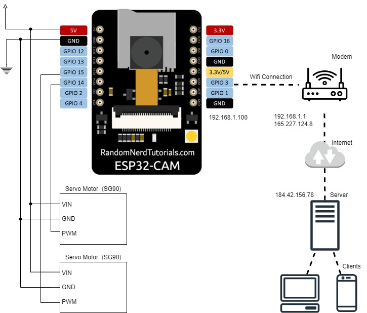
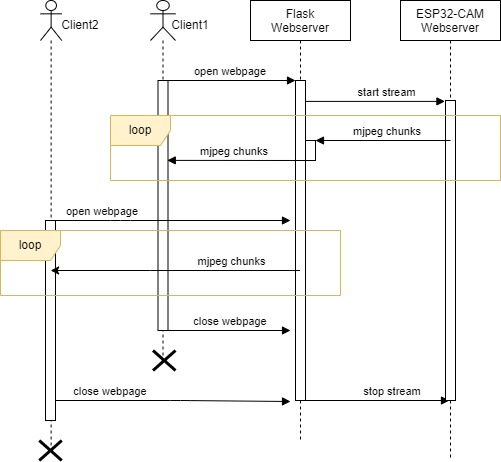

# DIY Security Camera with ESP32-CAM

* MCU with Camera and Wifi (ESP32-CAM)
* rotatable in two axis with two servo motors (SG90)
* camera can be viewed and motors can be controlled via the internet
* compiled with Arduino framework


## Project Overview



TODO: here gif of camera in action

## Reqirements

* ESP32-CAM (Ai-Thinker)
* 2x SG90
* Power supply 5V/2A
* Arduino IDE
* Python 3
* Modem that can port forwarding
* Static IP
* Linux VPS to deploy the backend

## Installation Guide

Due to the number of features that the project has It would be great idea to install components step by step and to see everything works correctly. 

* Setup the circuit (power the ESP32, wire SG-90s, ...)
* Create the Config.h.
* Compile the embedded code with Arduino IDE and upload to the ESP32. 
* Access the ESP32 from a device in the same LAN, e.g. your Windows PC. See the camera, rotate the servo motors.
* Install the backend server into your local machine, e.g. your Windows PC. During installation, use the local IP of the ESP in .env file.
* Run the local backend server (Flask's Web Server) to reach ESP32. You should be able to access a web page that is designed to see and rotate the camera.

After these steps, if you want, you can deploy the project into a VPS server and control the camera via internet.

* buy/request static IP from your ISP. 
* buy a Linux VPS. (Ubuntu recommended)
* configure your modem to forward incoming requests from VPS's IP address to local IP address of your ESP32.
* Install the backend server into your Linux VPS. During installation, use the static IP of your modem in .env file.
* Run the backend server (Flask's Web Server) to reach ESP32. You should be able to access a web page that is designed to see and rotate the camera. (don't think it was done, you need to deploy it with gunicorn and nginx. because Flask's server is not good enough to run standalone.)
* Install gunicorn and nginx. Configure and run them to see the same result.

## Embedded Part

## Installation

The project includes the library [ESP32Servo](https://github.com/jkb-git/ESP32Servo) that uses Arduino's Servo lib. Install it with Ardiuno IDE.

Create Config.h file with desired configurations by looking Config_Template.h file.
You have option to choose static or dynamic local IP. Use a static local IP if there is no restriction in your LAN.

## Features

Following HTTP Requests (GET) are defined:

- http://&#60;LOCAL_IP&#62;:&#60;SERVER_STREAM_PORT&#62;/mjpeg
- http://&#60;LOCAL_IP&#62;:&#60;SERVER_SERVO_PORT&#62;/control_servo?tr=integer,el=integer

Example HTTP Requests:

- http://192.168.1.100:80/mjpeg
Start mjpeg stream with mime type = multipart/x-mixed-replace
- http://192.168.1.100:81/control_servo?tr=5&el=-10
Control servo motors with query parameters 'tr' and 'el' (traverse and elevation in degree) 

## Port Forwarding

If you want to reach your ESP32-CAM from the internet you need to have a static IP address. Most of ISPs provides it usually with a fee. After that, you need to configure your modem such that incoming requests from the internet go to desired local machine, your ESP. 

Example configuration:

all IPs:80 --> 192.168.1.100:80

all IPs:81 --> 192.168.1.100:81

However, if all the incoming requests go to the ESP, your MCU could not handle all the traffic.
So, It would be wise to set a firewall or at least some rule in the modem. Lets assume that your ESP32-CAM has a local IP address 192.168.1.100, your modem's public IP is 1.2.3.4 and your server's IP is 5.6.7.8

5.6.7.8:80 --> 192.168.1.100:80

5.6.7.8:81 --> 192.168.1.100:81

To sum up, if you are in the same network, you can send a request to ESP with local IP adress 192.168.1.100. If you are outside of the network you need to have a computer whose IP is 5.6.7.8 and then you can send a request to 1.2.3.4 to reach the ESP.

## Backend Part

Python Flask web server to broadcast mjpeg stream and to control servo motors to rotate the ESP32-CAM.

Briefly, when clients opened the web page served by Flask Server, the server opens a single connection to ESP32-CAM and distributes received data to clients. Backend server basically have two responsibilities:

* To access ESP32-CAM via the internet
* To establish a single and secure connection to ESP32-CAM. Direct connection between clients and ESP32 would be dangerous, because ESP32's server is very simple and vulnerable in addition to its low processing power that cannot handle multiple requests. 



## Installation

Create a .env file in the directory. It should be in the following format.

```
HTTP_AUTH_USERNAME=exampleUser
HTTP_AUTH_PASSWORD=longNicePassword
CAM_URL=http://<ip-address-of-esp>/mjpeg
SERVO_URL=http://<ip-address-of-esp>/control_servo
```

Note: The IP address could be local IP of ESP32-CAM if the server is running locally, otherwise it should be your static IP.

### Virtual Environment for Python

Create a python virtual environment for the server not to collide with the global python libs. 

```
cd securityCam/server
python -m venv VENV_CAM

// activate venv (os dependent)
Win: VENV_CAM\Scripts\activate.bat
Linux: source VENV_CAM/bin/activate

// install necessary python libs
pip install -r requirement.txt
```

### Test with Flask's Server
```
python main.py
```
It should be accessible from internet (or could be locally accessible). 

Notes:
- Don't forget to add a rule to allow the port specified (for example 5000 in this repo) in main.py for firewall. (or change the code to serve on a known port)
- Don't forget to allocate enough buffer size for each jpeg frame in `client.request_buffers()`. Otherwise, it silently won't work. (py-mjpeg's bug or feature :D ) It is preconfigured for ESP32-CAM and should work with changing nothing.

## Deployment

The flask app can be deployed with a web server and a wsgi as recommended, because flask's built-in server is vulnerable. To provide a reverse proxy Nginx and Gunicorn seem excellent choices. (only works on Linux)
Install them following online tutorials.

### Nginx configuration

Create the following file to configure nginx web server.

/etc/nginx/sites-available/example.conf
```
server {
    listen 80;
    server_name your-domain.com;

    location / {
        include proxy_params;
        proxy_pass http://unix:/run/cam.gunicorn.sock;
        proxy_buffering off;
        proxy_request_buffering off;
        proxy_socket_keepalive on;
        proxy_redirect off;
        add_header Last-Modified $date_gmt;
        add_header Cache-Control 'no-store, no-cache';
        if_modified_since off;
        expires off;
        etag off;
    }
}
```

Notes:
- Cached images in browsers are a problem for streaming. This nginx configuration tries to solve this issue by saying to browsers please don't cache images that i'll send.
- Don't forget add symlink to other nginx folder
`ln -s /etc/nginx/sites-available/example.conf /etc/nginx/sites-enabled/` 

### Gunicorn configuration

Gunicorn is an alternative to Flask's built-in web server and communicates with Nginx. 

Gunicorn duplicates flask instances for each worker. And my code has a global jpg producer (mjpeg-client). Because this global object is duplicated by wsgi, mjpeg-client will be duplicated as well.
This means for each video stream, a socket will be opened to the ESP32-CAM that cannot handle. Wsgi should be configured not to duplicate flask instances.
`--workers 1` will create only one instance. `--threads int` will create threads that shares the global object. Thread number will limit the maximum allowed user at a time, because every stream (MIME:x-mixed-replace makes it busy) blocks a thread.

My flask server has multiple client support but it causes fps drop. Later, maybe i'll use/write another mjpeg stream lib instead of py-mjpeg.

Additionally, instead of starting gunicorn manually we can create a service that will be triggered automatically when request has come.

/etc/systemd/system/cam.gunicorn.service
```
[Unit]
Description=gunicorn daemon for cam
Requires=cam.gunicorn.socket
After=network.target

[Service]
User=root
Group=www-data
WorkingDirectory=path-to-project-folder/securityCam/server
ExecStart=path-to-project-folder/securityCam/server/VENV_CAM/bin/gunicorn \
          --access-logfile - \
          --workers 1 \
          --threads 5 \
          --worker-class=gthread \
          --bind unix:/run/cam.gunicorn.sock \
          --timeout 600 \
          wsgi:app

[Install]
WantedBy=multi-user.target
```

/etc/systemd/system/cam.gunicorn.socket
```
[Unit]
Description=gunicorn socket for cam

[Socket]
ListenStream=/run/cam.gunicorn.sock

[Install]
WantedBy=sockets.target
```

After creating these files start services. Following bash commands provide info about how to stop it as well. 
```
// start services (gunicorn automatically triggers nginx)
sudo systemctl start cam.gunicorn.socket

// to see everything works correctly
sudo systemctl status cam.gunicorn.socket // should be active
file /run/cam.gunicorn.sock // output should be: /run/cam.gunicorn.sock: socket

// if fails, how to see logs
sudo journalctl -u cam.gunicorn.socket 

// stop them (stop both of them, because they automatically trigger each other )
sudo systemctl stop cam.gunicorn.socket // to stop socket
sudo systemctl stop cam.gunicorn.service // to stop service

// if you changed /etc/systemd/system/cam.gunicorn.service
// run these to restart
sudo systemctl daemon-reload
sudo systemctl restart gunicorn
```

## Limitations or TODOs

* Servo motors should not be connected directly to the MCU. Not a big deal. I was lazy, don't do it.
* ESP32 and backend communicate with HTTP connection, not HTTPS which is undesirable. Both backend and embedded part should support HTTPS. Clients and backend communicate with HTTP as well, this could be solved relatively easy compared to the former without changing a code.
* The python library py-mjpeg has some limitations about number of users. If multiple user connect to server at the same time, received frames distributed to all connected users so users cannot see some frames and experience fps drop. There are ways to solve this problem in addition to using another library.